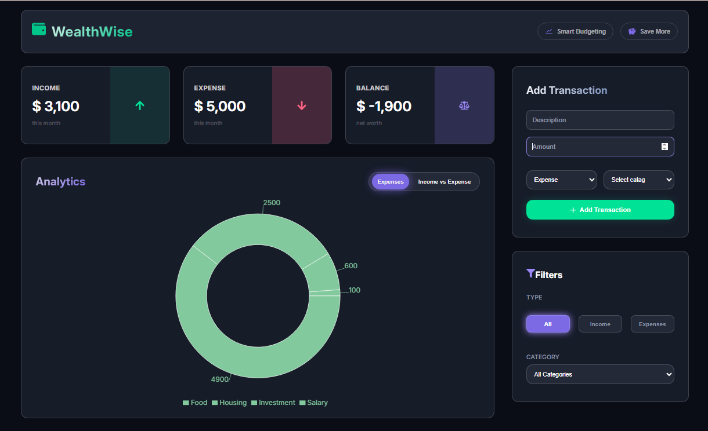

# 💰 WealthWise — Expense Tracker with Charts

A modern, responsive expense tracker built with **React** and **Vite**. WealthWise lets you log income and expenses, visualize your spending with interactive charts, track your monthly budget progress, and filter transactions by type or category — all with data saved locally in your browser.



---

## ✨ Features

- **Add Transactions** — Log income or expenses with a description, amount, and category.
- **Summary Cards** — Instantly see your total Income, Expenses, and Balance.
- **Interactive Charts** — Toggle between:
  - A **pie chart** breaking down expenses by category
  - A **bar chart** comparing total income vs. expenses
  
  (Powered by [Recharts](https://recharts.org/))
- **Monthly Budget Progress** — A visual progress bar shows how close you are to your budget limit, with an "On Track" / "Over Budget" status indicator.
- **Transaction History** — View all transactions in a list, with the ability to **edit** or **delete** any entry.
- **Filtering** — Filter transactions by type (Income / Expenses) or by category (Salary, Food, Housing, etc.).
- **Delete Confirmation Modal** — Prevents accidental deletion of transactions.
- **Success / Error Toasts** — Instant feedback when a transaction is added or a form field is missing.
- **Persistent Storage** — All data is saved in the browser's `localStorage`, so your transactions remain after refreshing the page.
- **Responsive UI** — Clean, card-based dashboard layout that works across screen sizes.

---

## 🛠️ Tech Stack

| Technology | Purpose |
|---|---|
| [React 19](https://react.dev/) | UI library |
| [Vite](https://vitejs.dev/) | Build tool & dev server |
| [Recharts](https://recharts.org/) | Data visualization (pie & bar charts) |
| [React Icons](https://react-icons.github.io/react-icons/) | Icon set |
| Context API | Global state management |
| CSS Modules | Component-scoped styling |
| ESLint | Code linting |

---

## 📂 Project Structure

```
Expense-Tracker-Chart/
├── src/
│   ├── components/
│   │   ├── Header.jsx              # Top navigation bar
│   │   ├── Cards.jsx                # Income / Expense / Balance summary cards
│   │   ├── ChartContainer.jsx       # Pie & bar chart toggle view
│   │   ├── Progress.jsx             # Monthly budget progress bar
│   │   ├── FormSidebar.jsx          # Add transaction form + filters
│   │   ├── TransactionRecords.jsx   # List of all transactions
│   │   ├── EditForm.jsx             # Edit transaction modal
│   │   ├── ConfirmBox.jsx           # Delete confirmation modal
│   │   ├── Sussessful.jsx           # Success / error toast notification
│   │   └── NoRecords.jsx            # Empty state when no transactions exist
│   ├── context/
│   │   └── context.jsx              # Global app state (Context API)
│   ├── css/                         # CSS Modules for each component
│   ├── App.jsx                      # Root component / layout
│   ├── App.css                      # Global layout styles
│   └── main.jsx                     # App entry point
├── index.html
├── package.json
├── vite.config.js
└── eslint.config.js
```

---

## 🚀 Getting Started

### Prerequisites

- [Node.js](https://nodejs.org/) (v18 or higher recommended)
- npm (comes bundled with Node.js)

### Installation

1. **Clone the repository**
   ```bash
   git clone https://github.com/<your-username>/<your-repo-name>.git
   cd <your-repo-name>
   ```

2. **Install dependencies**
   ```bash
   npm install
   ```

3. **Run the development server**
   ```bash
   npm run dev
   ```
   The app will be available at `http://localhost:5173` (or the port shown in your terminal).

### Available Scripts

| Command | Description |
|---|---|
| `npm run dev` | Starts the development server with hot reload |
| `npm run build` | Builds the app for production |
| `npm run preview` | Previews the production build locally |
| `npm run lint` | Runs ESLint to check code quality |

---

## 📖 Usage

1. Fill in the **Add Transaction** form on the right with a description, amount, type (Income/Expense), and category.
2. Submit the form to see your transaction reflected in the **Summary Cards**, **Charts**, and **Transaction List**.
3. Use the **filter buttons/dropdown** to narrow the transaction list by type or category.
4. Click the **edit** icon on any transaction to update it, or the **delete** icon to remove it (with confirmation).
5. Track your **Monthly Budget Progress** bar to see how much of your budget has been used.

---

## 🗺️ Roadmap / Ideas for Future Improvements

- [ ] Allow the user to set a custom monthly budget (currently fixed at $5000)
- [ ] Add date-range filtering
- [ ] Export transactions to CSV/PDF
- [ ] Add authentication and cloud sync (currently uses `localStorage` only)
- [ ] Dark mode toggle

---

## 🤝 Contributing

Contributions, issues, and feature requests are welcome!

1. Fork the project
2. Create your feature branch (`git checkout -b feature/AmazingFeature`)
3. Commit your changes (`git commit -m 'Add some AmazingFeature'`)
4. Push to the branch (`git push origin feature/AmazingFeature`)
5. Open a Pull Request

---

## 📄 License

This project is open source and available under the [MIT License](LICENSE).

---

## 👤 Author

**Ali Raza**

If you find this project useful, consider giving it a ⭐ on GitHub!